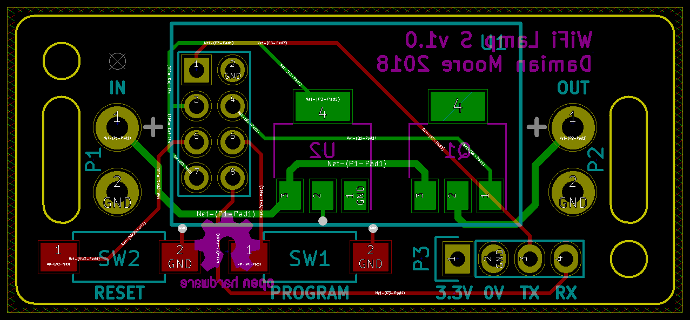

# wifi-lamp

A simple wifi-enabled lamp control board based on the ESP8266. It is intended
primarily to help retrofit existing LED lamps, giving them switching and dimming
functionality through a web browser or home automation system.

