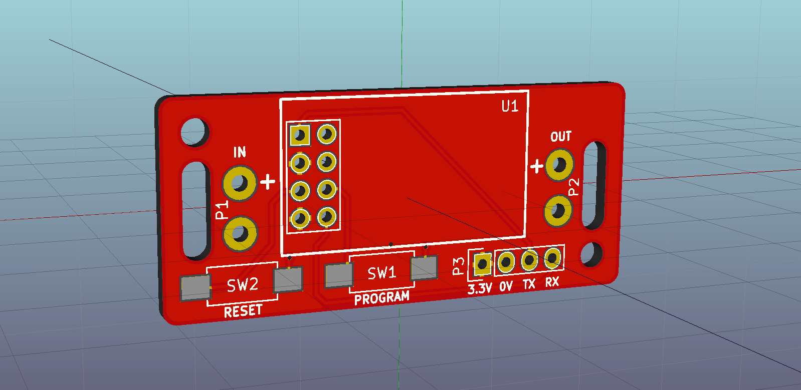
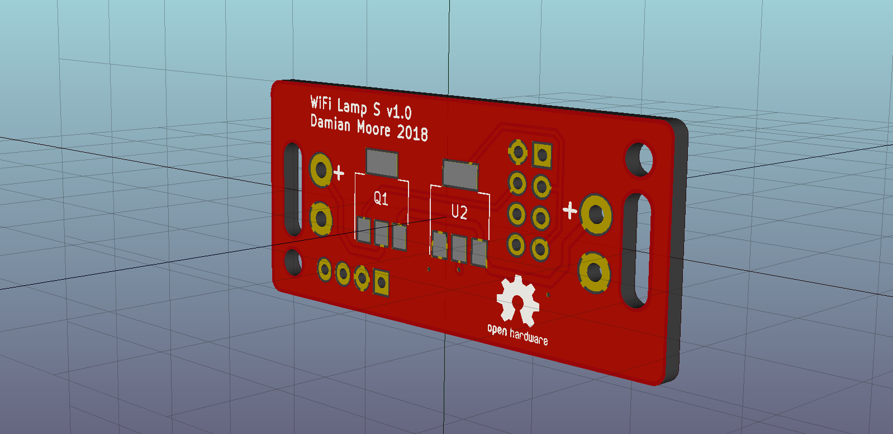
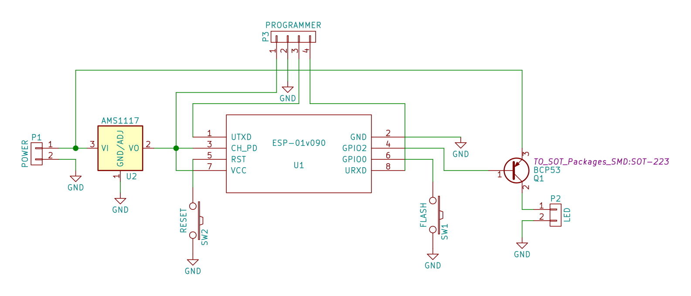

# WiFi Lamp

A simple wifi-enabled lamp control board based on the ESP8266. It is intended
primarily to help retrofit existing LED lamps, giving them switching and dimming
functionality through a web browser or home automation system.

The project is based around the ESP8266-01 module as it is widely available,
small, very cheap, easily programmable, and directly connects to your existing
wifi network.

The included electronics files (schematic and PCB layout) are designed in KiCad.

An RS-232 USB-to-serial convertor is required for programming. If you use this
adaptor to power the device while programming, it must output 3.3V (not higher).

## Specifications

 * Input voltage: **3.3 – 15V**
 * LED PWM dimmer frequency: **1000 Hz**

## Components (BOM)

 * ESP8266-01 module
 * AMS1117 3.3V voltage regulator, SOT-223 package
 * BCP53 transistor, SOT-223 package
 * 2 × SMD SPST switches, ~6mm wide × ~3mm deep
 * Row of 4 header pins

## Renderings

## Schematic

## Overview of the layers used for PCB production

